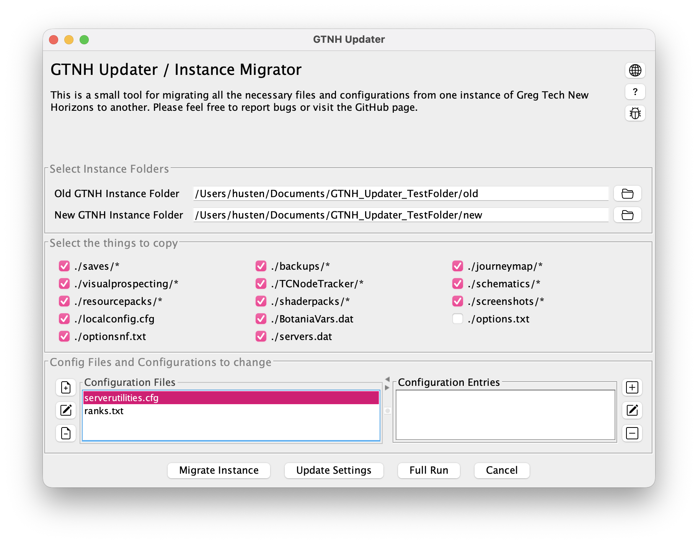

# GTNH Updater
Small utility for migrating or updating GTNH Instances.

## Requirements
- Java 17
- Important Assumptions: This tool assumes...
    - ... that you are using a Minecraft Launcher like Prism to manage your GTNH Instances
    - ... that you have separate instances for the old and new version of the game and you want to migrate from the old to the new one

## How to Use
- Open the tool
- Select the folder of the old and new Greg Tech: New Horizons Instance
- Select which parts or aspects of the old instance should be copied (see [https://gtnh.miraheze.org/wiki/Installing_and_Migrating#Updating])
- (Optional) Select some config files and settings to update
- Press...
  - ... "Migrate Instance" if you want to solely migrate your instance
  - ... "Update Settings" if you want to solely change your config files
  - ... "Full Run" if you want to do both of the above
